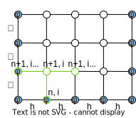

Уравнение теплопроводности для одномерного случая:
$$\frac{\partial T(x,t)}{\partial t}=-\frac{\partial W(x,t)}{\partial x}+Q(x,t),$$ 
где $x$ – координата по пространству, $t$ – координата по времени, $T$ – функция температуры, $W$ – поток энергии через поперечное сечение, $Q$ – энергия, выделяемая истоником. \
При этом поток энергии равен:
$$W(x,t)=-a(x,t)\cdot\frac{\partial T(x,t)}{\partial x},$$
где $a$ – функция коэффициента температуропроводности. \
В рассматриваемом случае дополнительное тепло не выделяется $Q(x,t)=const=0$, а функция коэффициента температуропроводности зависит только от координаты по пространству $a(x)$:
$$\frac{\partial T(x,t)}{\partial t}=-\frac{\partial W(x,t)}{\partial x}$$
Поток энергии равен:
$$W(x,t)=-a(x)\cdot\frac{\partial T(x,t)}{\partial x}$$
Разностная неявная схема для изменения потока тепла на следующей строке по времени:
$$\frac{\partial W(x,t)}{\partial x}=\frac{W_{i+1}^{n+1}-W_{i-1}^{n+1}}{h},$$
где $h$ – шаг по пространству. \
Тогда:
$$W_{i+1}^{n+1}=-a_{i+1}^{n+1}\cdot\frac{T_{i+1}^{n+1}-T_{i}^{n+1}}{h}$$
$$W_{i-1}^{n+1}=-a_{i-1}^{n+1}\cdot\frac{T_{i}^{n+1}-T_{i-1}^{n+1}}{h}$$
Разностная неявная схема для одномерного уравнения теплопроводности:

    

$$\frac{T_{i}^{n+1}-T_{i}^{n}}{\tau}=-\frac{W_{i+1}^{n+1}-W_{i-1}^{n+1}}{h},$$
где $\tau$ – шаг по времени.
$$\frac{T_{i}^{n+1}-T_{i}^{n}}{\tau}=\frac{a_{i+1}^{n+1}\cdot\frac{T_{i+1}^{n+1}-T_{i}^{n+1}}{h}-a_{i-1}^{n+1}\cdot\frac{T_{i}^{n+1}-T_{i-1}^{n+1}}{h}}{h}$$
$$=\frac{a_{i+1}^{n+1}\cdot(T_{i+1}^{n+1}-T_{i}^{n+1})-a_{i-1}^{n+1}\cdot(T_{i}^{n+1}-T_{i-1}^{n+1})}{h^2}=$$
$$=\frac{a_{i+1}^{n+1}\cdot T_{i+1}^{n+1}-(a_{i+1}^{n+1}+a_{i-1}^{n+1})\cdot T_{i}^{n+1}+a_{i-1}^{n+1}\cdot T_{i-1}^{n+1}}{h^2}$$
Приведем выражение в линейный вид:
$$T_{i}^{n+1}-T_{i}^{n}=\frac{\tau}{h^2}\cdot\biggl(a_{i+1}^{n+1}\cdot T_{i+1}^{n+1}-(a_{i+1}^{n+1}+a_{i-1}^{n+1})\cdot T_{i}^{n+1}+a_{i-1}^{n+1}\cdot T_{i-1}^{n+1}\biggr)$$
$$a_{i+1}^{n+1}\cdot(-\frac{\tau}{h^2})\cdot T_{i+1}^{n+1}+\biggl(1+(a_{i+1}^{n+1}+a_{i-1}^{n+1})\cdot\frac{\tau}{h^2}\biggr)\cdot T_{i}^{n+1}+a_{i-1}^{n+1}\cdot(-\frac{\tau}{h^2})\cdot T_{i-1}^{n+1}=T^{n}_{i}$$
На строке шириной M элементов:
* при $m=0$:
$$T_{0}^{n+1}=\phi_{1}^{n+1},$$
где $\phi$ – граничное условие.
* при $m\in{[1;M-1]}$:
$$a_{i+1}^{n+1}\cdot(-\frac{\tau}{h^2})\cdot T_{i+1}^{n+1}+\biggl(1+(a_{i+1}^{n+1}+a_{i-1}^{n+1})\cdot\frac{\tau}{h^2}\biggr)\cdot T_{i}^{n+1}+a_{i-1}^{n+1}\cdot(-\frac{\tau}{h^2})\cdot T_{i-1}^{n+1}=T_{i}^{n}$$
* при $m=M$:
$$T_{M}^{n+1}=\phi_{2}^{n+1}$$
Алгоритм прогонки для решения трехдиагональных СЛАУ
Так как элементы одной строки (по времени) линейно связаны друг с другом, можно составить матрицу:
$$\begin{equation}
A=\begin{pmatrix}
1 \\
a_1 & b_1 & c_1 \\
    & a_2 & b_2 & c_2 \\
    &     &     & \ddots \\
    &     &     & a_{M-1} & b_{M-1} & c_{M-1} \\
    &     &     &         &         & 1 \\
\end{pmatrix}=\begin{pmatrix}
    d_0 \\
    d_1 \\
    d_2 \\
    \vdots \\
    d_{M-1} \\
    d_M \\
\end{pmatrix}
\end{equation},$$
$a=a_{i+1}^{n+1}\cdot(-\frac{\tau}{h^2}),$ \
$b=1+(a_{i+1}^{n+1}+a_{i-1}^{n+1})\cdot\frac{\tau}{h^2},$ \
$c=a_{i-1}^{n+1}\cdot(-\frac{\tau}{h^2}),$ \
$d=T_{i}^{n},$ \
$b_0=b_M=1,$ \
пустые множители – нули.  
Прогоночное уравнение:
$$T_i=p_{i+1}\cdot T_{i+1} + q_{i+1},$$
где $p$ и $q$ – прогоночные коэффициенты. \
Для первого уравнения:
$$b_0\cdot T_0+ c_0\cdot T_1=d_0,$$
коэффициенты $p$ и $q$ будут равны:
$$p_1=-\frac{c_0}{b_0}$$
$$q_1=\frac{d_0}{b_0}$$
Для i-го уравнения:
$$a_i\cdot T_{i-1}+b_i\cdot T_i+c_i\cdot T_{i+1}=d_i$$
коэффициенты $p$ и $q$ будут равны:
$$p_{i+1}=\frac{-c_i}{a_i\cdot p_i+b_i}$$
$$q_{i+1}=\frac{d_i-a_i\cdot q_i}{a_i\cdot p_i+b_i}$$
В последнем уравнении нужно рассчитать $T_M$:
$$T_M=\frac{d_M-a_M\cdot q_M}{p_M\cdot a_M+b_M}$$
Далее в обратном порядке рассчитать все $T_i$:
$$T_i=p_{i+1}\cdot T_{i+1} + q_{i+1}$$

